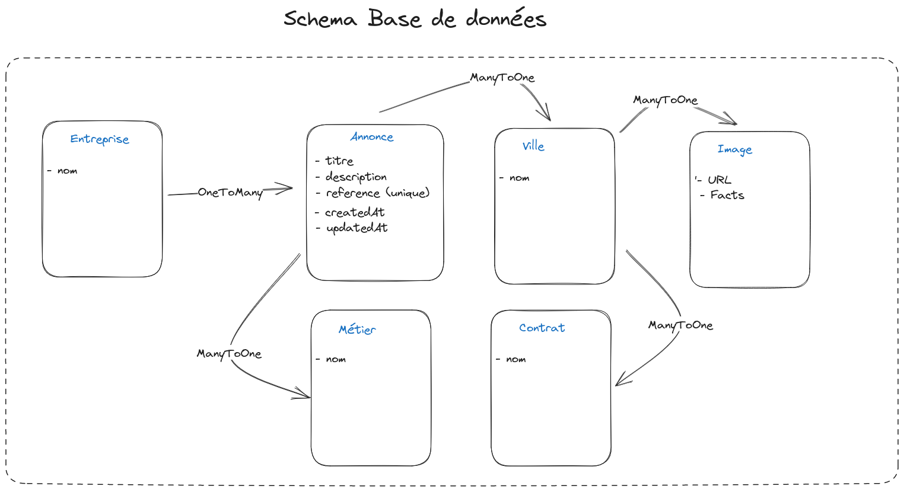

# Job Board Subslill

_Ce projet à été réalisé lors d'un test technique pour l'entreprise Subskill_
<br>
_Réalisé à l'aide du Framework Symfony le projet était d'afficher des offres d'emploi contenu dans une base de données, de pouvoir filtrer les résultats, mais aussi d'ajouter, modifier ou supprimer une offre via une API REST._

## Schéma base de données

Voici le schéma de base de données que j'ai imaginé selon les consignes données.



## Fonctionnalité du site

Comme demandé, le site permet d'afficher des offres d'emploi, 10 offres par page sont affichées, une barre de navigation en haut du site permet de changer de page.

Il y a aussi la possibilité de filtré les résultats selon l'intitulé de l'offre, la date de publication, le métier le contrat ou bien la ville.

On peut trier les offres par ordre alphabétique de leur intitulé ou de leur date de publication en cliquant sur le texte "intitulé" ou "date de publication".

On peut effacer les filtres avec le bouton "reset filter".

## API

Une API permet d'ajouter, modifier ou effacer une offre.

**Ajouter une offre :**
Avec la route http://127.0.0.1:8000/api/annonce/add

Exemple :

```sh
curl -X POST http://127.0.0.1:8000/api/annonce/add -H 'Content-Type: application/json' -d '{"title": "Alternant développeur backend", "description": "On recherche un alternant backend", "reference": 123456, "entreprise": "Subskill", "ville": "Paris", "metier": "Developpeur", "contrat": "Alternance"}'
```

Si la requete a fonctionner, cela renvoit les infos entrer sinon une erreur est renvoyé (champ manquant). Si aucun lien d'image n'est fournit, une image est ajouté grầce à l'api Some Random API.

Si vous entrez un metier, une ville ou un contrat qui n'existe pas en base de donnée, ce dernier est créé.

**Modifier une offre :**
La modification d'une offre se fait via la référence : http://127.0.0.1:8000/api/annonce/editByReference/{reference}

Exemple :

```sh
curl -X PUT http://127.0.0.1:8000/api/annonce/editByReference/123456 -H 'Content-Type: application/json' -d '{"contrat": "CDI"}'
```

Seuls les champs précisés sont modifiés.

**Supprimer une offre :**
La suppression d'une offre se fait via la référence : http://127.0.0.1:8000/api/annonce/deleteByReference/{reference}

Exemple :

```sh
curl -X DELETE http://127.0.0.1:8000/api/annonce/deleteByReference/123456 -H 'Content-Type: application/json' -d '{"contrat": "CDI"}'
```
